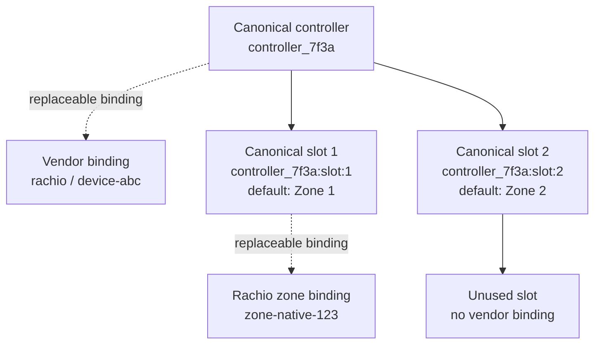
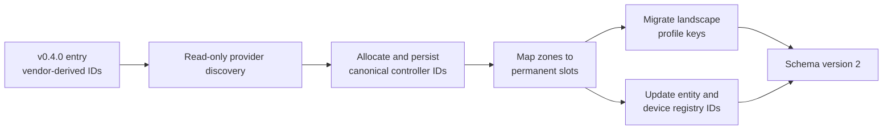

# IrrigationOS v0.4.1 Architecture

v0.4.1 stabilizes controller identity and observation semantics before any command execution is introduced. IrrigationOS remains strictly Observation-only.

## Major subsystems

### Canonical identity registry

`ControllerIdentityRegistry` generates and persists provider-neutral controller IDs in config-entry data. Rachio controller and zone IDs exist only inside explicit `VendorBinding` records. Mutable controller, vendor-zone, and landscape names never participate in identity.

### Permanent controller slots

Each controller exposes canonical slots from 1 through detected capacity. Slot IDs use `<canonical-controller-id>:slot:<number>`, and their default presentation names remain `Zone 1`, `Zone 2`, and so on. Configured Rachio zones bind to their physical slots; unused slots remain explicit and their Home Assistant entities are registered disabled by default.

### Observation reliability

Every controller snapshot carries an observation timestamp, freshness horizon, provider source, quality, and endpoint-specific errors. A successful current-schedule observation confirms `idle` or `watering`; a safe secondary-endpoint failure preserves the base snapshot but reports `unknown` and partial quality instead of inferring idle.

### Provider composition

Provider-neutral config-flow and coordinator code create adapters through `ControllerProviderFactory` and consume the generic controller contract and provider errors. Rachio payload translation, capacity inference, bindings, API calls, and error types remain under `adapters/rachio/`.

### Dynamic entity reconciliation

Sensor and binary-sensor platforms track registered canonical IDs and add controllers or slots discovered after startup. Missing hardware remains registered but unavailable, using last-known safe state rather than raising property exceptions. Rediscovery reuses the same canonical identity.

### Landscape Digital Twin binding

Landscape profiles are keyed by canonical configured-slot IDs. Vendor names can supply display defaults, while user overrides remain separate from controller facts. Unused slots do not count as configured landscape areas.

### Migration from v0.4.0

Config-entry schema version 1 used `rachio:<native-id>` registry and landscape keys. The version 2 migration performs a read-only discovery, allocates canonical controller IDs, maps vendor zones to permanent slots, migrates profile overrides, and updates matching Home Assistant entity and device registry identifiers.

Migration requires successful provider discovery. A physical controller replacement is not guessed from a mutable name and therefore requires an explicit future rebinding workflow.

### Diagnostics, tests, and safety

Diagnostics retain observation metadata while redacting credentials, vendor bindings, account identifiers, canonical identifiers, coordinates, and the persisted identity registry. Behavioral tests cover identity stability, slot placeholders, migration, partial failures, provider composition, reconciliation, and diagnostic redaction. No start, stop, scheduling, rain-delay, or command-delivery endpoint exists in v0.4.1.
