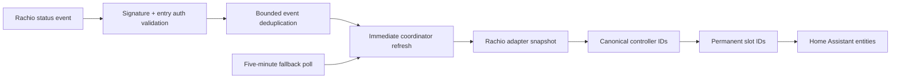

# IrrigationOS v0.4.2 Realtime Architecture

v0.4.2 adds authenticated push observation around the v0.4.1 canonical model. The five-minute coordinator remains the source-of-truth reconciler and IrrigationOS remains Observation-only.

## URL and local lifecycle

The provider-neutral `RealtimeObservationManager` persists one webhook ID and authorization secret per config entry and registers that webhook with Home Assistant for external `POST` delivery. It prefers a cloudhook only when Home Assistant reports an active Cloud subscription. Otherwise it generates a standard external webhook URL. URLs must use HTTPS and a nonlocal, nonprivate host. Failure creates a repair warning but does not fail config-entry setup.

## Remote Rachio lifecycle

The Rachio adapter discovers observation event categories and reconciles one remote notification subscription per controller. An entry-scoped prefix distinguishes owned registrations from other applications. Equivalent subscriptions are retained, changed subscriptions are updated, and owned duplicates are deleted. Reload cleanup and startup reconciliation prevent accumulation. Poll-discovered controller additions and removals trigger another reconciliation.

## Delivery and canonical refresh

The local handler validates the Rachio HMAC signature and the entry-specific external authorization value before processing an event. It accepts device, zone, schedule, rain-delay, and rain-sensor status families, including zone start, stop, completion, cycling, and pause subtypes. Duplicate event IDs receive a successful no-op response. A valid new event records only safe metadata and immediately refreshes the complete provider snapshot, preserving canonical controller and slot identity.

## Diagnostics and safety

Diagnostics report realtime enablement, URL source, remote registration health, last safe event metadata, accepted/rejected/duplicate counts, and polling fallback state. Webhook URLs, webhook IDs, authorization values, API tokens, signatures, vendor IDs, and canonical IDs are redacted. Notification-subscription administration is the only new remote write behavior; no irrigation-control endpoint exists.
